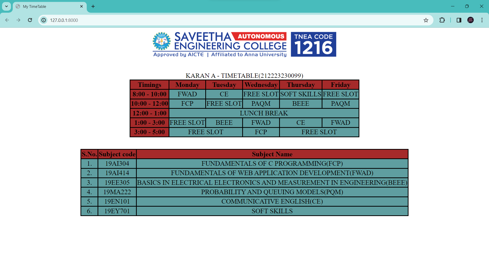

# Experiment_Time_Table

## AIM
To Write a html webpage page to display your timetable.

# ALGORITHM
### STEP 1
Create a simple table using table tag
### STEP 2
Add header row using th tag
### STEP 3
Add your timetable
### STEP 4
Execute the program

# CODE
```
NAME : KARAN A
REGISTER NUMBER : 212223230099
```
```
<!DOCTYPE html>
<head>
 <title>My TimeTable</title>
 <style>
    table,td,th,tr{
        border: solid black;
        border-collapse: collapse;
        zoom: 110%;
    }
    td{
        background-color: cadetblue;
        text-align: center;
    }
    th{
        background-color: brown;
    }

 </style>
</head>
<body>
    <center>
    
</center><br><br>
<center><table id="TimeTable">
    <caption style="font-size: larger;">KARAN A - TIMETABLE(212223230099)</caption>
    <tr>
        <th>Timings</th>
        <th>Monday</th>
        <th>Tuesday</th>
        <th>Wednesday</th>
        <th>Thursday</th>
        <th>Friday</th>
    </tr>
    <tr>
        <th>8:00 - 10:00</th>
        <td>FWAD</td>
        <td>CE</td>
        <td>FREE SLOT</td>
        <td>SOFT SKILLS</td>
        <td>FREE SLOT</td>
    </tr>
    <tr>
        <th>10:00 - 12:00</th>
        <td>FCP</td>
        <td>FREE SLOT</td>
        <td>PAQM</td>
        <td>BEEE</td>
        <td>PAQM</td>
    </tr>
    <tr>
        <th>12:00 - 1:00</th>
        <td colspan="5">LUNCH BREAK</td>
    </tr>
    <tr>
        <th>1:00 - 3:00</th>
        <td>FREE SLOT</td>
        <td>BEEE</td>
        <td>FWAD</td>
        <td>CE</td>
        <td>FWAD</td>

    </tr>
    <tr>
        <th>3:00 - 5:00</th>
        <td colspan="2">FREE SLOT</td>
        <td>FCP</td>
        <td colspan="2">FREE SLOT</td>
    </tr>
</table></center><br><br>
<center>
    <table>
        <tr>
            <th>S.No.</th>
            <th>Subject code</th>
            <th>Subject Name</th>
        </tr>
        <tr>
            <td>1.</td>
            <td>19AI304</td>
            <td>FUNDAMENTALS OF C PROGRAMMING(FCP)</td>
        </tr>
        <tr>
            <td>2.</td>
            <td>19AI414</td>
            <td>FUNDAMENTALS OF WEB APPLICATION DEVELOPMENT(FWAD)</td>
        </tr>
        <tr>
            <td>3.</td>
            <td>19EE305</td>
            <td>BASICS IN ELECTRICAL ELECTRONICS AND MEASUREMENT IN ENGINEERING(BEEE)</td>
        </tr>
        <tr>
            <td>4.</td>
            <td>19MA222</td>
            <td>PROBABILITY AND QUEUING MODELS(PQM)</td>
        </tr>
        <tr>
            <td>5.</td>
            <td>19EN101</td>
            <td>COMMUNICATIVE ENGLISH(CE)</td>
        </tr>
        <tr>
            <td>6.</td>
            <td>19EY701</td>
            <td>SOFT SKILLS</td>
        </tr>
    </table>
</center>
</body>
</html>
```

# OUTPUT

# RESULT
Thus the program is executed successfully.
